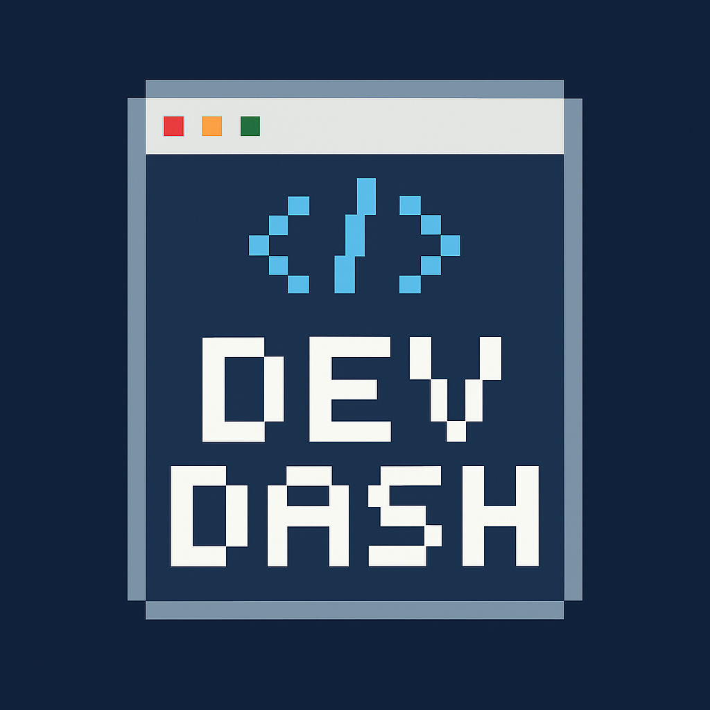

<h1 align="center">DevDash: The Ultimate Developer's Dashboard</h1>

Transform your browser's new tab page into a stunning, personalized command center for all your development activities.
 
<a href="#-about-the-project"><strong>Explore the features »</strong></a>
 
 
<a href="https://www.google.com/search?q=https://github.com/Suresh-MS07/DevDash/issues">Report Bug</a>
·
<a href="https://www.google.com/search?q=https://github.com/Suresh-MS07/DevDash/issues">Request Feature</a>

<!-- Badges -->

<!-- Table of Contents -->

Table of Contents

<ol>
<li><a href="#-about-the-project">About The Project</a></li>
<li><a href="#-key-features">Key Features</a></li>
<li><a href="#-built-with">Built With</a></li>
<li><a href="#-getting-started">Getting Started</a>
<ul>
<li><a href="#prerequisites">Prerequisites</a></li>
<li><a href="#installation--setup">Installation & Setup</a></li>
</ul>
</li>
<li><a href="#-configuration">Configuration</a></li>
<li><a href="#-project-structure">Project Structure</a></li>
<li><a href="#-contributing">Contributing</a></li>
<li><a href="#-license">License</a></li>
<li><a href="#-contact">Contact</a></li>
</ol>

✨ About The Project
DevDash is not just another new tab extension. It's a meticulously crafted, all-in-one dashboard designed to streamline the modern developer's workflow. By integrating essential services like GitHub, LeetCode, and Stack Overflow with powerful productivity tools, DevDash centralizes your digital life, saving you time and keeping you focused.

Its elegant glassmorphism UI and fluid design provide a visually pleasing experience, turning a mundane new tab into a hub of information and productivity.

(Pro Tip: Replace the placeholder above with a real screenshot of your awesome dashboard!)

🚀 Key Features
API-Driven Widgets
🌤️ Live Weather: Real-time weather updates for any city.

👨‍💻 GitHub Activity: Stay updated with your latest public repository events.

💻 LeetCode Stats: Track your problem-solving progress across Easy, Medium, and Hard difficulties.

❔ Stack Overflow: Display your reputation and badge counts with pride.

📰 Developer News: Curated feeds from Hacker News and Dev.to to keep you in the loop.

Productivity Suite
✅ To-Do List: A simple yet effective task manager with local persistence.

📝 Quick Notes: A handy scratchpad for jotting down thoughts, reminders, or code snippets.

🍅 Pomodoro Timer: Boost your focus and manage your time effectively with a built-in Pomodoro timer.

🔗 Quick Links: Customizable shortcuts to your most frequently visited sites.

Customization & Performance
🎨 Customizable Layout: Enable or disable widgets to create a dashboard that's uniquely yours.

⚡ Efficient Caching: Smart data caching mechanism reduces API calls, ensuring lightning-fast load times.

💎 Modern UI/UX: A beautiful and responsive "glassmorphism" design that looks great on any screen size.

🛠️ Built With
This project is built with modern web technologies and leverages several third-party APIs.

Core: HTML5, CSS3, JavaScript (ES6+)

Browser Integration: Chrome Extension Manifest V3, chrome.storage API

APIs:

OpenWeatherMap API

GitHub API

LeetCode API (Unofficial)

Hacker News (Firebase) API

Stack Exchange API

Dev.to API

🏁 Getting Started
Follow these instructions to get a local copy up and running.

Prerequisites
A Chromium-based browser (e.g., Google Chrome, Brave, Microsoft Edge).

git installed on your local machine.

Installation & Setup
Clone the repository:

git clone [https://github.com/your-username/DevDash.git](https://github.com/Suresh-MS07/DevDash.git)

Navigate to the browser's extension management page:

Open chrome://extensions (or your browser's equivalent).

Enable Developer Mode:

Toggle the "Developer mode" switch, usually located in the top-right corner.

Load the extension:

Click on the "Load unpacked" button.

Select the DevDash folder that you cloned.

You're all set! Open a new tab to experience your DevDash.

⚙️ Configuration
To unlock the full power of DevDash, you need to configure the API keys and usernames in the settings panel.

Open a new tab to view the DevDash dashboard.

Click the Settings icon (⚙️) in the top-right corner.

Fill in the required fields:

GitHub: Your username and a Personal Access Token with public_repo scope.

LeetCode: Your LeetCode username.

OpenWeatherMap: A free API key from their website.

Stack Overflow: Your User ID (found in your profile URL).

Customize widget visibility and add your personal quick links.

Click "Save Settings" and enjoy your personalized dashboard!

📂 Project Structure
A brief overview of the project's file structure.

.
├── 📄 dashboard.html      # The main dashboard page markup
├── 🎨 dashboard.css       # Core styles for the dashboard UI/UX
├── ⚙️ dashboard.js        # Main application logic, API fetching, and widget rendering
├── 📄 options.html         # The settings page markup
├── 🎨 options.css          # Styles for the settings page
├── ⚙️ options.js          # Logic for saving/loading user settings
├── 📄 manifest.json       # The heart of the extension, defines permissions and behavior
├── 🖼️ icon.jpg            # Main application icon
└── 📄 README.md           # You are here!

🤝 Contributing
Contributions are what make the open-source community such an amazing place to learn, inspire, and create. Any contributions you make are greatly appreciated.

If you have a suggestion that would make this better, please fork the repo and create a pull request. You can also simply open an issue with the tag "enhancement".

Fork the Project

Create your Feature Branch (git checkout -b feature/AmazingFeature)

Commit your Changes (git commit -m 'Add some AmazingFeature')

Push to the Branch (git push origin feature/AmazingFeature)

Open a Pull Request

📄 License
Distributed under the MIT License. See LICENSE file for more information.

📧 Contact
Suresh Mewada -sureshmewada990@gmail.com

Project Link: https://github.com/Suresh-MS07/DevDash
