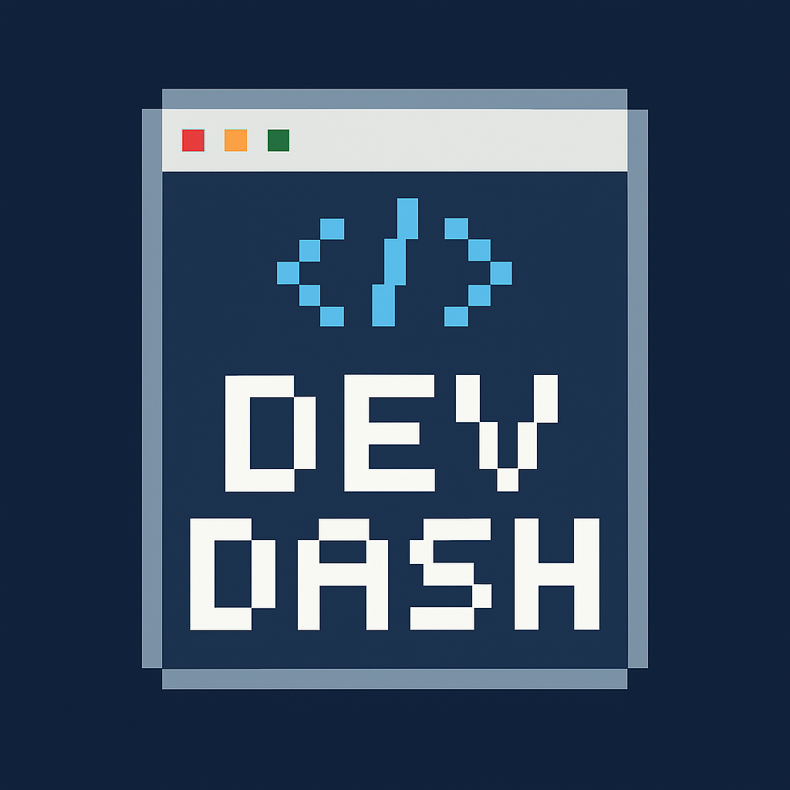

<div align="center">
  
  <h1>DevDash</h1>
  <p>A privacy-conscious developer command center for every new browser tab.</p>

  [](https://github.com/Suresh-MS07/DevDash/actions/workflows/ci.yml)
  [](https://developer.chrome.com/docs/extensions/develop/migrate/what-is-mv3)
  [](https://developer.mozilla.org/docs/Web/JavaScript)
  [](LICENSE)

  [Report a bug](https://github.com/Suresh-MS07/DevDash/issues/new) · [Request a feature](https://github.com/Suresh-MS07/DevDash/issues/new) · [View repository](https://github.com/Suresh-MS07/DevDash)
</div>

## Overview

DevDash replaces the default Chromium new tab with a responsive dashboard for coding activity, technical news, focus, and lightweight planning. It is built with vanilla HTML, CSS, and JavaScript on Chrome Extension Manifest V3—there is no build step and no runtime dependency.

## Features

### Developer activity

- Public GitHub activity without requiring a personal access token
- LeetCode totals split by Easy, Medium, and Hard
- Stack Overflow reputation and badge counts
- Curated Dev.to articles and Hacker News stories

### Focus and productivity

- Weather for a configured city
- Custom quick links with URL validation
- Persistent to-do list and quick notes
- 25-minute Pomodoro timer
- Per-widget visibility controls

### Reliability and privacy

- API caching with service-specific expiration windows
- Stale-cache fallback during temporary API failures
- 12-second network timeout to prevent hanging widgets
- User-generated and API content rendered with safe DOM APIs
- OpenWeatherMap key stored only in local extension storage
- No analytics, tracking scripts, remote JavaScript, or GitHub token

## Install locally

1. Clone the repository:

   ```bash
   git clone https://github.com/Suresh-MS07/DevDash.git
   cd DevDash
   ```

2. Open `chrome://extensions` in Chrome, Edge, Brave, or another Chromium browser.
3. Enable **Developer mode**.
4. Select **Load unpacked** and choose the cloned `DevDash` directory.
5. Open a new tab, then use the settings button to configure your widgets.

## Configuration

| Setting | Required for | Storage |
|---|---|---|
| GitHub username | Public activity | Synced |
| LeetCode username | Problem statistics | Synced |
| Weather city | Weather widget | Synced |
| OpenWeatherMap API key | Weather widget | Local device only |
| Stack Overflow user ID | Reputation and badges | Synced |
| Quick links and visibility | Personalization | Synced |
| To-dos, notes, and API cache | Local productivity | Local device only |

You can create a free weather key at [OpenWeatherMap](https://openweathermap.org/api). The GitHub widget uses the public Events API and does not request repository permissions.

## Architecture

```text
dashboard.html / dashboard.css
        │
        └── dashboard.js
             ├── API widgets + cache layer
             ├── local productivity widgets
             └── visibility preferences

options.html / options.css
        │
        └── options.js
             ├── settings validation
             ├── secret migration to local storage
             └── cache management
```

## Project structure

```text
.
├── .github/workflows/ci.yml
├── scripts/validate.mjs
├── dashboard.html
├── dashboard.css
├── dashboard.js
├── options.html
├── options.css
├── options.js
├── manifest.json
├── icon.png
├── package.json
├── CONTRIBUTING.md
├── SECURITY.md
├── LICENSE
└── README.md
```

## Development and validation

DevDash has no production dependencies. Node.js is used only for repository checks.

```bash
npm test
```

The validation command checks JavaScript syntax, Manifest V3 configuration, required files, API host permissions, placeholder links, and unsafe HTML injection patterns. The same command runs in GitHub Actions on pushes and pull requests.

## API and cache behavior

| Service | Cache duration |
|---|---:|
| GitHub | 5 minutes |
| Hacker News | 10 minutes |
| Weather / Dev.to | 15 minutes |
| LeetCode / Stack Overflow | 1 hour |

If a request fails but an older cache entry exists, DevDash shows the cached response instead of leaving the widget blank.

## Contributing

Bug fixes, accessibility improvements, documentation, and new widgets are welcome. Read [CONTRIBUTING.md](CONTRIBUTING.md) before opening a pull request.

For security concerns, follow the private reporting instructions in [SECURITY.md](SECURITY.md) instead of opening a public issue.

## License

Distributed under the [MIT License](LICENSE).

## Author

**Suresh Mewada**  
[GitHub](https://github.com/Suresh-MS07) · [LinkedIn](https://www.linkedin.com/in/suresh-mewada07/) · [Email](mailto:sureshmewada990@gmail.com)
